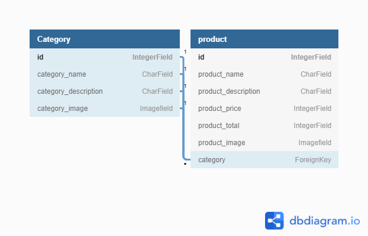

# Neemas Shop

## User stories

* As a user of this site
  * I want to be able to register an account
    * Because i want the newsletter with info on special offers

* As a user of this site
  * If i have created an account, i want to be able to delete it
    * Because i don't want the newsletter anymore

* As a user of this site
  * I want to be able to easily browse and filter the products
    * Because i don't want to spend to much time searching, then i rather go somewhere else

* As a user of this site
  * I want to be able to add products to a cart, go to checkout and pay for them
    * Because ordering by mail and swishing money is less convenient

* As a user of this site
  * I want clear feedback on my actions, like "email sent"
    * Because otherwise it leaves me wondering if it worked

* As a user of this site
  * I want to be able to contact the owner of the site
    * Because i might have questions

* As the owner of this site
  * I want to showcase my products
    * Because i want to sell them

* As the owner of this site
  * I want to collect email addresses
    * Because i want to advertise my products via mail

## Features

### Existing features

#### Navbar

It includes a logo (that also links back to the homepage) and links to homepage, store, contact, cart, users page, register, login and logout. The logout and users page will only be available when user is logged in and the register and login will only be visible when the user is logged out or not yet registered.

#### Homepage

It contains links to 3 categories: small things in nature, water and forest.

#### Store

From the start, it contains all products with name and price sorted by category. You can click the images and get to a details page that gives a little more information. On the store page it's possible to filter by category and all products.

#### Contact

This page contains a contact form. The user can send an email to me via this form.

#### Cart

Users can add and remove from cart and click a button to get to checkout. The page also displays VAT and grand total. If the cart is empty, then the page displays a link to keep shopping.

#### Checkout

I integrated Stripes prebuilt checkout page in the project. After successful purchase the user is redirected back to a success page. There is also the option to cancel and being redirected to a cancel page.

#### Users page

The user can see the personal details entered and change them. The user can also change password and delete the profile.

#### Login

The user can login to the site and can also click a link to reset password. The user will then enter his or her email and then recieves an email. If the user follows the link in the email he or she can create a new password.

#### Logout

A simple log out page. when logged out the user will be presented with a link to log in again.

#### Register

The user have to enter username and password. The page also collects first name, last name and email.

#### The footer

Contains social media accounts and the option to call the site owner.

### Features to implement

A points system. The customer get a point for each successful purchase and after 10 purchases get a discount.

## Techs used

* HTML
* CSS
* Javascript
* Python
* Django
* Bootstrap
* AWS s3

## Db diagram



## Testing

### Evaluation of user stories

#### From user perspective

The user is able to register an account and when doing that the user can also register an email and that will make it possible for the site owner to send newsletter with special offers.

The user is able to delete his/her account if he/she so wish to do.

The user can easily browse the products and filter them.

The user can order and pay directly on the site.

The user gets clear feedback where needed.

The user can contact the owner if needed via the contact form, social media or phone.

#### From the site owners perspective

The owner can showcase and sell her products via the site

The owner can collect emails via the site

### Manual testing

* Home page
  * Links to category pages works fine

* Store page
  * Images reacts as expected when hovering over them with mouse
  * Link to detailspage works fine
  * Filtering works fine
  * Exceptionhandling when clicking filter without option works fine

* Details page
  * It looks as intended and the add to cart button works fine

* Cart
  * Checkout button works fine
  * Remove button works fine
  * Values display as they should
  When empty a different content is displayed

* Checkout page
  * Everything works as intended with the payment
  * I can see on the stripe dashboard that payments are complete
  * The cancel and success redirections works as they should
  * The right info is displayed on the Checkout page

* Contact page
  * Everything works as intended

* Users page
  * everything works as intended

* Authentication system
  * Everything works as intended
  * Some different content is displayed when logged in compared to logged out
  * The reset password function works as intended

* Navigation and footer links
  * Everything works as intended


### Validator testing

* [CSS](https://jigsaw.w3.org/css-validator/validator)
  * No errors found when using the Jigsaw validator

* [HTML](https://validator.w3.org/)
  * No errors remaining now when passing through the w3c validator

* [JS](https://jshint.com/)
  * No errors found. Some warnings that i missed semicolons, fixed that.

* [Python](http://pep8online.com/)
  * No errors when passing it through PEP8 online check

### Unit testing

I have tested my Python code as far as i am capable of.

* Is the data returned from a filled out contactform valid?
  * Pass (Yes it is)

* Is it possible to submit the contactform with an empty name field?
  * Pass (It's not)

* Is the Category model represented correctly as a string?
  * Pass (It is)

* Do the views in the store app return the intended resources?
  * Pass (They are)

## Deployment

### Go to Heroku

* Click new and create a new app
* Give it a name, and choose the region closest to you
* Then on the resources tab, provide a new Postgres database for it (Heroku Postgres)
* We'll just use the free plan
* To use Postgres we need to go back to gitpod and install dj_database_url, and psycopg2

### In your project

> pip3 install dj_database_url

> pip3 install psycopg2-binary

> pip3 freeze > requirements.txt

* Let's get our stores new database setup. By going to settings.py. And importing dj_database_url.

```py
import dj_database_url
```
* Then down in the databases setting. I'll comment out the default configuration and replace the default database with a call to dj_database_url.parse and give it the database URL from Heroku which you can either get from your config variables in your app settings tab or from the command line by typing Heroku config.

```py
DATABASES = {
    'default': dj_database_url.parse('paste db_URL')
}
```

* Migrate

> python3 manage.py migrate

* Create a superuser

> python3 manage.py createsuperuser

* With this finished our Heroku app and database are ready to go.

* Before you commit, remove the Heroku database config and uncomment the original so your database URL doesn't end up in version control.

* With that done you can commit.

* Let's use an if statement in settings.py, so that when our app is running on Heroku where the database URL environment variable will be defined, we connect to Postgres and otherwise, we connect to Postgresql.

```py
if 'DATABASE_URL' in os.environ:

    DATABASES = {

       'default': dj_database_url.parse(os.environ.get('DATABASE_URL'))

    }

else:

    DATABASES = {

        'default': {

            'ENGINE': 'django.db.backends.sqlite3',

            'NAME': os.path.join(BASE_DIR, 'db.sqlite3'),

        }
    }
```

* We'll need a few other things if we want our deployment to work on the first try. First we need to install gunicorn, which will act as our webserver and freeze that into our requirements file.

> pip3 install gunicorn

> pip3 freeze > requirements.txt

* Now we can create our Procfile, by creating a new file and naming it Procfile. In that file write:

> web: gunicorn name of project.wsgi:application

* Now we need to temporarily disable collectstatic from the Heroku dashboard

### Go to Heroku config vars

> key: DISABLE_COLLECTSTATIC value: 1

### In your project

* And you'll need to add the hostname of your Heroku app to allowed hosts in settings.py

```py
ALLOWED_HOSTS = ['heroku-app-name.herokuapp.com', 'localhost']
```

* Now you can commit changes to GitHub
* After that, in your CLI write:

> heroku login -i

* And then deploy to Heroku with:

> heroku git:remote -a heroku-app-name

> git push heroku master

* Let's set it up to automatically deploy when you push to GitHub

### Go to Heroku

* Go to your app in Heroku and on the deploy tab set it to connect to github.
* Search for your repository.
* Click connect.
* With that finished you can enable automatic deploys.
* And now every time you push to github your code will automatically be deployed to Heroku as well.

### In your project

* Let's remove the secret key from your settings.
* Get a secret key from [here](https://djecrety.ir/).
* Paste it in to the Heroku settings in config vars: SECRET_KEY in the first field and then the key.
* Normally you want to generate a new one for Gitpod.
* With that created you can go back to settings.py and replace the secret key setting with the call to get it from the environment and use an empty string as a default.

```py
SECRET_KEY = os.environ.get('SECRET_KEY', '')
```

* While you're here please set debug to be true only if there's a variable called development in the environment. You need to put the variable in env.py if you want debug to be True in development. You could also just do True or False. But don't forget that it has to be set to False when deploying!

> DEBUG = 'DEVELOPMENT' in os.environ

* And now you can commit these changes and push them to github.

## Credit

### Media

I got all my images from [Pexels](https://www.pexels.com/sv-se/).

### Content

I integrated the Stripe API following [this tutorial](https://stripe.com/docs/checkout/integration-builder) and using the code from there.

All icons come from [Font Awsome](https://fontawesome.com/)


